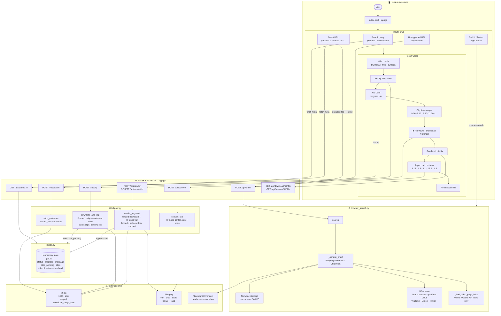
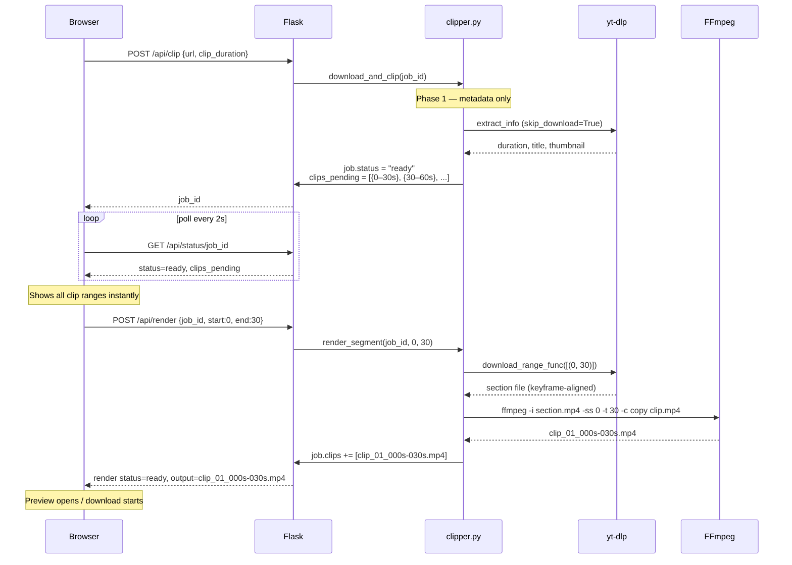

# VideoClipper

A full-stack web app to search, preview, and clip videos from YouTube, Vimeo, Reddit, Twitter/X, and any website. Built with Flask + yt-dlp + FFmpeg + Playwright.

---

## Architecture Overview

### System Architecture



---

### Clip Lifecycle (Key Flow)



---

### File Responsibilities

| File | Responsibility |
|------|---------------|
| `app.py` | Flask routes, threading, job/render/conversion dispatch |
| `clipper.py` | yt-dlp integration, FFmpeg subprocess, lazy render logic |
| `browser_search.py` | Playwright crawl, network intercept, platform URL extraction |
| `jobs.py` | Thread-safe in-memory job store, auto-cleanup after 1h |
| `utils.py` | FFmpeg check, URL detection, clip filename formatting |
| `app.js` | All UI logic — polling, lazy render, cancel, preview modal |
| `index.html` | Single-page shell |
| `style.css` | Dark theme, component styles |

---

## Features

- Search videos on YouTube, Vimeo, and other supported sites
- Paste any URL — yt-dlp fetches it, or Playwright crawls the page for video files
- Lazy rendering — clips show as time ranges instantly; download/render only the segment you want
- Custom clip duration (30s / 45s / 60s / custom start–end)
- Aspect ratio conversion (9:16, 4:5, 1:1, 16:9, 4:3) for social media
- In-browser video preview before downloading
- Cancel a render mid-way
- Browser cookie support (Chrome, Firefox, Edge, Brave, etc.) or upload a `cookies.txt`
- Runs locally or on Google Colab with ngrok

---

## Project Structure

```
Web_clipper/
├── backend/
│   ├── app.py              # Flask API server
│   ├── clipper.py          # yt-dlp download + FFmpeg clip logic
│   ├── browser_search.py   # Playwright-based URL crawler
│   ├── jobs.py             # In-memory job store
│   └── utils.py            # Shared helpers
├── frontend/
│   ├── index.html          # Single-page UI
│   ├── app.js              # All frontend logic
│   └── style.css           # Dark theme styling
├── deploy/
│   └── VideoClipper_Colab.ipynb   # One-click Google Colab deploy
├── requirements_clipper.txt
└── .gitignore
```

---

## Local Setup

### Prerequisites

| Tool | Version | Notes |
|------|---------|-------|
| Python | 3.10+ | 3.7–3.9 may work but yt-dlp shows deprecation warning |
| FFmpeg | Any recent | Must be in PATH or at `C:\ffmpeg\bin\ffmpeg.exe` |
| Git | Any | For cloning |

### 1. Clone the repo

```bash
git clone https://github.com/YOUR_USERNAME/YOUR_REPO.git
cd Web_clipper
```

### 2. Create a virtual environment

```bash
# Windows
py -3.10 -m venv venv
.\venv\Scripts\Activate.ps1

# macOS / Linux
python3 -m venv venv
source venv/bin/activate
```

### 3. Install Python dependencies

```bash
pip install -r requirements_clipper.txt
```

### 4. Install Playwright browser

```bash
playwright install chromium
```

### 5. Install FFmpeg

**Windows:**
```powershell
winget install Gyan.FFmpeg
```
Or download from https://ffmpeg.org/download.html and add to PATH.

**macOS:**
```bash
brew install ffmpeg
```

**Linux:**
```bash
sudo apt install ffmpeg
```

### 6. Run the app

```bash
cd backend
python app.py
```

Open your browser at: **http://localhost:5000**

---

## How to Use

### Search for videos
1. Type a site name (e.g. `youtube`) or paste any URL in the **Website URL or Name** field
2. Type a search query (not needed for direct URLs)
3. Select clip duration and quality
4. Click **Find & Clip**

### Clip a video
- Search results appear as cards — click **✂️ Clip This Video** on any result
- Metadata is fetched instantly; clip time ranges appear immediately
- Click **▶ Preview** or **↓ Download** on a specific clip — it renders only that segment on demand
- Click **✕ Cancel** to stop a render in progress

### Aspect ratio conversion
After a clip is rendered, conversion buttons appear (9:16, 4:5, 1:1, 16:9, 4:3). Click any to re-encode for social media.

### Browser cookies (for age-restricted or login-required videos)
- Select your browser from the **Browser Cookies** dropdown — cookies are read from your local browser profile
- Or select **Upload cookies.txt** and upload a file exported via the [Get cookies.txt LOCALLY](https://chrome.google.com/webstore/detail/get-cookiestxt-locally/cclelndahbckbenkjhflpdbgdldlbecc) extension

### Crawl any URL
Paste a URL that yt-dlp doesn't support — the app automatically falls back to Playwright, which opens the page in a headless browser and intercepts video file requests.

---

## Google Colab Deploy

Run the app in the cloud, accessible from any device (phone, tablet, etc.).

1. Upload the project folder to Google Drive (skip `venv/` and `tmp/`)
2. Get a free ngrok token from https://dashboard.ngrok.com/get-started/your-authtoken
3. Open `deploy/VideoClipper_Colab.ipynb` in Google Colab
4. Paste your ngrok token in Cell 6
5. Click **Runtime → Run all**
6. A public URL appears — open it on any device

Clips are saved to Google Drive and persist across sessions.

---

## API Reference

| Method | Endpoint | Description |
|--------|----------|-------------|
| POST | `/api/search` | Search or fetch video metadata |
| POST | `/api/clip` | Create a clip job |
| GET | `/api/status/:job_id` | Poll job status |
| POST | `/api/render` | Render a specific clip segment on demand |
| GET | `/api/render/:render_id` | Poll render status |
| DELETE | `/api/render/:render_id` | Cancel a render |
| GET | `/api/download/:job_id/:clip` | Download a rendered clip |
| GET | `/api/preview/:job_id/:clip` | Stream a clip for in-browser preview |
| POST | `/api/convert` | Convert clip to a different aspect ratio |
| POST | `/api/crawl` | Playwright crawl a URL for videos |
| GET | `/api/ffmpeg-status` | Check if FFmpeg is available |

---

## Troubleshooting

**FFmpeg not found**
Make sure `ffmpeg` is in your PATH. Run `ffmpeg -version` to verify.

**Chrome/browser cookie error**
Select **None** in the Browser Cookies dropdown — most public videos don't need cookies.

**"Unsupported URL" error**
The app automatically retries with Playwright crawl. If the crawl also fails, the site likely requires login or uses DRM.

**Playwright error on Linux/Colab**
Install system dependencies:
```bash
playwright install-deps chromium
```

**Python 3.7 / 3.8 deprecation warning from yt-dlp**
Upgrade to Python 3.10+. Create a new venv with `py -3.10 -m venv venv`.

---

## Tech Stack

- **Backend:** Python, Flask, yt-dlp, FFmpeg, Playwright
- **Frontend:** Vanilla JS, HTML5, CSS3 (no framework)
- **Deploy:** Google Colab + pyngrok

---

## License

MIT
