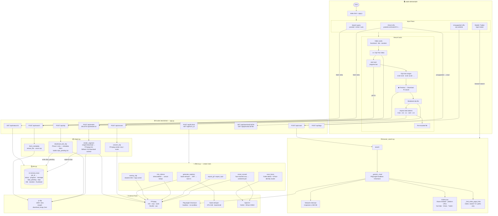
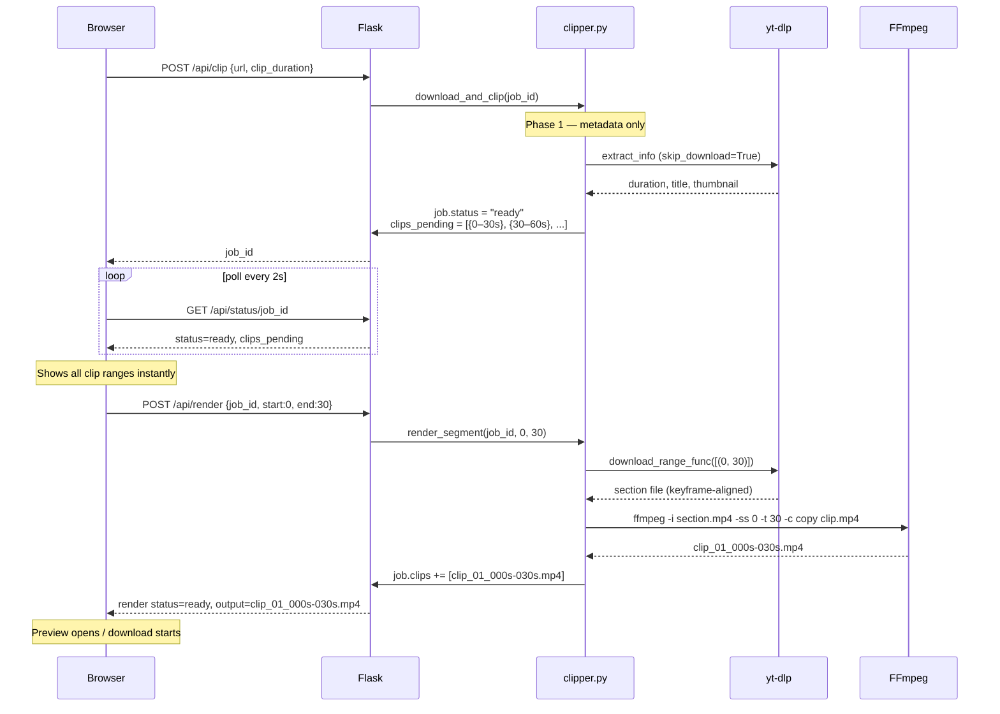

# VideoClipper

A full-stack web app to search, preview, and clip videos from YouTube, Vimeo, Reddit, Twitter/X, and any website — then polish clips for social media: auto-captions (Whisper), face-tracked cropping, text/logo overlays, silence trimming, and GIF/MP3 export. Built with Flask + yt-dlp + FFmpeg + Playwright + faster-whisper + OpenCV.

---

## Architecture Overview

### System Architecture



---

### Clip Lifecycle (Key Flow)



---

### File Responsibilities

| File | Responsibility |
|------|---------------|
| `app.py` | Flask routes, threading, job/render/conversion/fx dispatch |
| `clipper.py` | yt-dlp integration, FFmpeg subprocess, lazy render logic |
| `effects.py` | Creator tools — Whisper captions, overlays, silence trim, GIF/MP3, face scan + tracked crop |
| `browser_search.py` | Playwright crawl, network intercept, platform URL extraction |
| `jobs.py` | Thread-safe in-memory job store, auto-cleanup after 1h |
| `utils.py` | FFmpeg check, URL detection, clip filename formatting |
| `app.js` | All UI logic — polling, lazy render, Modify panels, face chips, preview modal |
| `index.html` | Single-page shell |
| `style.css` | Dark theme, component styles |

---

## Features

### Find & clip
- Search videos on YouTube, Vimeo, and other supported sites
- Paste any URL — yt-dlp fetches it, or Playwright crawls the page for video files
- Lazy rendering — clips show as time ranges instantly; download/render only the segment you want
- Custom clip duration (30s / 45s / 60s / custom start–end)
- True high-quality YouTube clips — section downloads use split video+audio DASH streams (the only way past YouTube's 720p combined-stream cap), stream-validated, with automatic fallback
- Smart speed: per-job format memo, preview caching, and one-shot full download + local slicing for short videos with many clips
- In-browser video preview before downloading; cancel a render mid-way
- Browser cookie support (Chrome, Firefox, Edge, Brave, etc.) or upload a `cookies.txt`
- Runs locally or on Google Colab with ngrok

### Creator tools (🛠 Modify panel on every rendered clip)
- **💬 Auto-captions** — faster-whisper transcription → SRT + burned-in subtitles. Language picker (Auto / हिन्दी / English) keeps captions in the spoken language; Devanagari/Arabic scripts get a compatible font automatically
- **👥 Pick faces** — scans the clip, clusters everyone by identity (YuNet + SFace), shows face thumbnails with screen-time %; select one or more and the aspect-ratio crop follows them
- **🎯 Track largest** — one-click face-tracked cropping without scanning
- **Aspect ratio conversion** (9:16, 4:5, 1:1, 16:9, 4:3) — center-crop or face-tracked
- **📝 Text/Logo overlay** — burned title (top/center/bottom) and/or logo image (any corner)
- **🤫 Trim silence** — cuts silent gaps automatically (silencedetect)
- **🖼 GIF / 🎵 MP3 export** — looping palette-optimized GIF (≤60s) and audio extraction
- **Chaining** — every output gets its own 🛠 button: crop to 9:16, then caption the result, then add a logo, in any order
- All outputs included in the per-job ZIP download

---

## Project Structure

```
Web_clipper/
├── backend/
│   ├── app.py              # Flask API server
│   ├── clipper.py          # yt-dlp download + FFmpeg clip logic
│   ├── effects.py          # Captions, overlays, trim, GIF/MP3, face tracking
│   ├── browser_search.py   # Playwright-based URL crawler
│   ├── jobs.py             # In-memory job store
│   └── utils.py            # Shared helpers
├── frontend/
│   ├── index.html          # Single-page UI
│   ├── app.js              # All frontend logic
│   └── style.css           # Dark theme styling
├── deploy/
│   └── VideoClipper_Colab.ipynb   # One-click Google Colab deploy
├── models/                 # Auto-downloaded ML models (gitignored)
├── requirements_clipper.txt
└── .gitignore
```

> ML models download automatically on first use: Whisper `base`/`small` go to
> your HuggingFace cache (`HF_HOME`, falls back to `models/`), and the OpenCV
> face ONNX models (~38 MB) go to `models/opencv/`. No manual setup.

---

## Local Setup

### Prerequisites

| Tool | Version | Notes |
|------|---------|-------|
| Python | 3.10+ | 3.7–3.9 may work but yt-dlp shows deprecation warning |
| FFmpeg | Any recent | Must be in PATH or at `C:\ffmpeg\bin\ffmpeg.exe` |
| Git | Any | For cloning |

### 1. Clone the repo

```bash
git clone https://github.com/YOUR_USERNAME/YOUR_REPO.git
cd Web_clipper
```

### 2. Create a virtual environment

```bash
# Windows
py -3.10 -m venv venv
.\venv\Scripts\Activate.ps1

# macOS / Linux
python3 -m venv venv
source venv/bin/activate
```

### 3. Install Python dependencies

```bash
pip install -r requirements_clipper.txt
```

### 4. Install Playwright browser

```bash
playwright install chromium
```

### 5. Install FFmpeg

**Windows:**
```powershell
winget install Gyan.FFmpeg
```
Or download from https://ffmpeg.org/download.html and add to PATH.

**macOS:**
```bash
brew install ffmpeg
```

**Linux:**
```bash
sudo apt install ffmpeg
```

### 6. Run the app

```bash
cd backend
python app.py
```

Open your browser at: **http://localhost:5000**

---

## How to Use

### Search for videos
1. Type a site name (e.g. `youtube`) or paste any URL in the **Website URL or Name** field
2. Type a search query (not needed for direct URLs)
3. Select clip duration and quality
4. Click **Find & Clip**

### Clip a video
- Search results appear as cards — click **✂️ Clip This Video** on any result
- Metadata is fetched instantly; clip time ranges appear immediately
- Click **▶ Preview** or **↓ Download** on a specific clip — it renders only that segment on demand
- Click **✕ Cancel** to stop a render in progress

### Modify a clip (🛠 panel)
Every rendered clip (and every output) has a **🛠 Modify** button. It opens a panel with:

- **Convert** — aspect-ratio buttons (9:16, 4:5, 1:1, 16:9, 4:3). Plain click = center-crop.
- **💬 Captions** — pick the language first (🌐 Auto / हिन्दी / English), then click. For Hindi speech, pin हिन्दी — auto-detect often mislabels it as Urdu. First run downloads the Whisper model once.
- **👥 Pick faces** — scans the clip and shows a thumbnail chip per person with screen-time %. Select one or more, then click an aspect ratio: the crop pans to follow the selected face(s). No selection + **🎯 Track largest** checked = follow the biggest face.
- **📝 Text/Logo** — type a title, choose position, optionally upload a logo image and corner, then Apply.
- **🤫 Trim Silence / 🖼 GIF / 🎵 MP3** — one click each.

Outputs appear as rows under the clip with ▶ preview, 🛠 modify (chain more edits), and ↓ download. Face-scan results live in memory — restarting the server requires re-scanning.

### Browser cookies (for age-restricted or login-required videos)
- Select your browser from the **Browser Cookies** dropdown — cookies are read from your local browser profile
- Or select **Upload cookies.txt** and upload a file exported via the [Get cookies.txt LOCALLY](https://chrome.google.com/webstore/detail/get-cookiestxt-locally/cclelndahbckbenkjhflpdbgdldlbecc) extension

### Crawl any URL
Paste a URL that yt-dlp doesn't support — the app automatically falls back to Playwright, which opens the page in a headless browser and intercepts video file requests.

---

## Google Colab Deploy

Run the app in the cloud, accessible from any device (phone, tablet, etc.).

1. Upload the project folder to Google Drive (skip `venv/` and `tmp/`)
2. Get a free ngrok token from https://dashboard.ngrok.com/get-started/your-authtoken
3. Open `deploy/VideoClipper_Colab.ipynb` in Google Colab
4. Paste your ngrok token in Cell 6
5. Click **Runtime → Run all**
6. A public URL appears — open it on any device

Clips are saved to Google Drive and persist across sessions.

---

## API Reference

| Method | Endpoint | Description |
|--------|----------|-------------|
| POST | `/api/search` | Search or fetch video metadata |
| POST | `/api/clip` | Create a clip job |
| GET | `/api/status/:job_id` | Poll job status |
| POST | `/api/render` | Render a specific clip segment on demand |
| GET | `/api/render/:render_id` | Poll render status |
| DELETE | `/api/render/:render_id` | Cancel a render |
| GET | `/api/download/:job_id/:clip` | Download a rendered clip |
| GET | `/api/preview/:job_id/:clip` | Stream a clip for in-browser preview |
| POST | `/api/convert` | Convert clip to a different aspect ratio |
| POST | `/api/fx/:kind` | Run a creator effect: `captions`, `overlay`, `trim-silence`, `gif`, `mp3`, `smart-crop`, `face-scan` |
| GET | `/api/fx/:fx_id` | Poll effect status (face-scan results in `extra.faces`) |
| POST | `/api/logo` | Upload a logo image for overlays (1h TTL) |
| POST | `/api/crawl` | Playwright crawl a URL for videos |
| GET | `/api/ffmpeg-status` | Check if FFmpeg is available |

---

## Troubleshooting

**FFmpeg not found**
Make sure `ffmpeg` is in your PATH. Run `ffmpeg -version` to verify.

**Chrome/browser cookie error**
Select **None** in the Browser Cookies dropdown — most public videos don't need cookies.

**"Unsupported URL" error**
The app automatically retries with Playwright crawl. If the crawl also fails, the site likely requires login or uses DRM.

**Playwright error on Linux/Colab**
Install system dependencies:
```bash
playwright install-deps chromium
```

**Python 3.7 / 3.8 deprecation warning from yt-dlp**
You're running the wrong interpreter (e.g. a pyenv shim) — activate the venv
first: `.\venv\Scripts\Activate.ps1`, then `python backend\app.py`.

**Captions come out as gibberish / wrong script**
Pin the language instead of Auto — Whisper often mislabels Hindi as Urdu.
The language dropdown sits left of the 💬 Captions button.

**Captions are slow**
Whisper runs on CPU. English uses the fast `base` model; other languages use
`small` (~2–4× realtime). First run also downloads the model once.

**Face scan finds nobody**
Faces must be reasonably frontal and visible in ≥5% of sampled frames.
Tiny/blurred faces and extreme profiles are skipped by design.

**Clip previews black or silent**
Sections are stream-validated since v2 — if you still see it, the cached file
predates the fix: delete the job (✕) and re-render.

---

## Tech Stack

- **Backend:** Python, Flask, yt-dlp, FFmpeg, Playwright
- **ML:** faster-whisper (captions), OpenCV YuNet + SFace (face detection/identity), Haar cascades (fallback tracking)
- **Frontend:** Vanilla JS, HTML5, CSS3 (no framework)
- **Deploy:** Google Colab + pyngrok

---

## License

MIT
